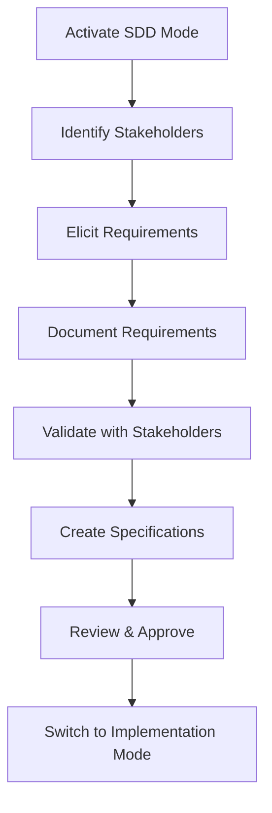
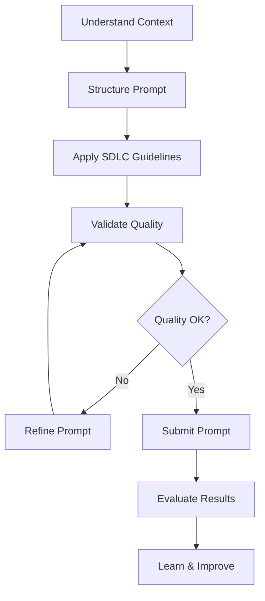
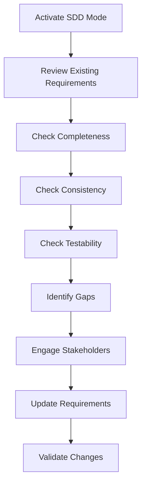

# Spec-Driven Development (SDD) Mode - Complete Guide

## Overview

The Spec-Driven Development (SDD) mode is a comprehensive framework for creating effective specifications and prompts throughout the Software Development Life Cycle (SDLC). It emphasizes the importance of requirements management and provides structured guidance for crafting high-quality prompts that lead to better development outcomes.

## Table of Contents

1. [What is Spec-Driven Development?](#what-is-spec-driven-development)
2. [Why SDD Matters](#why-sdd-matters)
3. [Getting Started](#getting-started)
4. [Core Components](#core-components)
5. [How to Use SDD Mode](#how-to-use-sdd-mode)
6. [SDLC Integration](#sdlc-integration)
7. [Best Practices](#best-practices)
8. [Examples and Templates](#examples-and-templates)
9. [Resources](#resources)

---

## What is Spec-Driven Development?

Spec-Driven Development (SDD) is a methodology that emphasizes creating comprehensive specifications before implementation. It ensures that:

- **Requirements are clear** and well-documented before coding begins
- **Stakeholders are aligned** on what needs to be built and why
- **Quality is built in** from the start through testable specifications
- **Communication is effective** between technical and non-technical stakeholders
- **Prompts are well-crafted** for AI-assisted development

### Key Principles

1. **Specification-First Approach**: Always start with clear specifications
2. **Holistic Specification**: Cover all aspects (functional, non-functional, constraints)
3. **Iterative Refinement**: Specifications evolve through feedback and validation
4. **Traceability**: Maintain clear links from requirements to implementation

---

## Why SDD Matters

### The Cost of Poor Requirements

Studies show that:
- **40-50%** of software defects originate from poor requirements
- **Fixing a defect** in production costs **100x more** than fixing it during requirements phase
- **Projects with good requirements management** are **97% more likely** to succeed

### Benefits of SDD

✅ **Reduced Errors**: Clear specifications prevent misunderstandings
✅ **Faster Development**: Less rework and clarification needed
✅ **Better Quality**: Testable requirements lead to better testing
✅ **Improved Communication**: Shared understanding among stakeholders
✅ **Cost Savings**: Catch issues early when they're cheaper to fix
✅ **Higher Satisfaction**: Deliver what stakeholders actually need

---

## Getting Started

### Prerequisites

Before using SDD mode, ensure you have:
- [ ] Access to stakeholders for requirements gathering
- [ ] Understanding of the business domain
- [ ] Basic knowledge of the SDLC phase you're working in
- [ ] Familiarity with your project's technical constraints

### Quick Start Guide

1. **Activate SDD Mode** in Bob
2. **Choose your focus**:
   - Requirements gathering
   - Specification creation
   - Prompt crafting
   - Requirements review
3. **Follow the interactive guide** for step-by-step assistance
4. **Use the templates** provided for your specific SDLC phase
5. **Validate your work** using the checklists

---

## Core Components

### 1. Main SDD Mode Prompt (`spec-driven-development.md`)

The main mode prompt provides:
- Comprehensive overview of SDD methodology
- Requirements management guidance
- Specification creation frameworks
- Prompt engineering best practices
- SDLC integration strategies
- Output formats and templates

**When to use**: As your primary reference for all SDD activities

### 2. Requirements Management Skill (`requirements-management-skill.md`)

A specialized skill that covers:
- Stakeholder analysis
- Requirements elicitation techniques
- Functional and non-functional requirements documentation
- Requirements prioritization (MoSCoW, Kano, WSJF)
- Requirements traceability
- Requirements validation and verification
- Change management

**When to use**: When you need deep expertise in requirements engineering

### 3. Requirements Traceability Analysis Skill (`requirements-traceability-skill.md`)

A specialized skill for deeper traceability audits:
- Forward and backward traceability validation
- Orphaned artifact detection
- Coverage metrics and reporting
- Git-based traceability workflows

**When to use**: When basic traceability notes are not enough and you need a
traceability audit or coverage analysis

**Traceability boundary**: Traceability matrices are realized only through
GitHub issues, Markdown documents, and code entries. External ALM systems,
databases, spreadsheet-only trackers, and proprietary traceability repositories
are out of scope unless a dedicated integration is added.

### 4. Interactive Guide (`sdd-interactive-guide.md`)

A step-by-step guide for crafting effective prompts:
- 5-step prompt crafting framework
- SDLC-specific guidelines for each phase
- Real-world examples and templates
- Validation checklists
- Common pitfalls and how to avoid them

**When to use**: When creating prompts for AI-assisted development

---

## How to Use SDD Mode

### Workflow 1: Starting a New Project

**Steps:**
1. Use SDD mode to conduct stakeholder analysis
2. Apply requirements elicitation techniques
3. Document functional and non-functional requirements
4. Validate requirements with stakeholders
5. Create detailed specifications
6. Switch to Architecture Review mode for technical validation
7. Return to SDD mode for final refinement
8. Switch to Code mode for implementation

### Workflow 2: Crafting Effective Prompts

**Steps:**
1. Use the interactive guide to understand your context
2. Follow the 5-step framework to structure your prompt
3. Apply SDLC-specific guidelines for your phase
4. Validate using the quality checklists
5. Submit and evaluate results
6. Iterate and improve based on outcomes

### Workflow 3: Requirements Review

**Steps:**
1. Use SDD mode to review existing requirements
2. Apply completeness, consistency, and testability checks
3. Identify gaps and inconsistencies
4. Engage stakeholders for clarification
5. Update requirements documentation
6. Validate changes with Architecture Review mode
7. Update traceability matrix

---

## SDLC Integration

SDD mode integrates with all SDLC phases:

### Planning Phase
**Focus**: Project scope, objectives, high-level requirements
**SDD Activities**:
- Stakeholder identification
- Business case development
- High-level requirements gathering
- Risk assessment
- Resource planning

**Example Prompt**: See [Planning Phase Prompts](./guides/sdd-interactive-guide.md#planning-phase-prompts)

### Requirements Phase
**Focus**: Detailed requirements gathering and documentation
**SDD Activities**:
- Requirements elicitation
- Functional requirements documentation
- Non-functional requirements specification
- Requirements prioritization
- Acceptance criteria definition

**Example Prompt**: See [Requirements Phase Prompts](./guides/sdd-interactive-guide.md#requirements-phase-prompts)

### Design Phase
**Focus**: Architecture and detailed design
**SDD Activities**:
- Architecture decision documentation
- Design specifications
- API contract definition
- Data model design
- Integration specifications

**Example Prompt**: See [Design Phase Prompts](./guides/sdd-interactive-guide.md#design-phase-prompts)

### Implementation Phase
**Focus**: Code development
**SDD Activities**:
- Implementation specifications
- Code structure guidance
- Error handling specifications
- Testing approach definition

**Example Prompt**: See [Implementation Phase Prompts](./guides/sdd-interactive-guide.md#implementation-phase-prompts)

### Testing Phase
**Focus**: Quality assurance and validation
**SDD Activities**:
- Test strategy definition
- Test case derivation from requirements
- Performance testing specifications
- Security testing requirements

**Example Prompt**: See [Testing Phase Prompts](./guides/sdd-interactive-guide.md#testing-phase-prompts)

### Deployment Phase
**Focus**: Production release
**SDD Activities**:
- Deployment specifications
- Configuration management
- Monitoring requirements
- Rollback procedures

**Example Prompt**: See [Deployment Phase Prompts](./guides/sdd-interactive-guide.md#deployment-phase-prompts)

### Maintenance Phase
**Focus**: Bug fixes and enhancements
**SDD Activities**:
- Bug analysis and specification
- Enhancement requirements
- Performance optimization specifications
- Technical debt documentation

**Example Prompt**: See [Maintenance Phase Prompts](./guides/sdd-interactive-guide.md#maintenance-phase-prompts)

---

## Best Practices

### For Requirements Management

#### DO ✅
- **Start with Why**: Always understand the business justification
- **Be Specific**: Use measurable, testable requirements
- **Involve Stakeholders**: Get feedback early and often
- **Prioritize Ruthlessly**: Not everything can be "must-have"
- **Maintain Traceability**: Link requirements to implementation
- **Document Assumptions**: Make implicit knowledge explicit
- **Use Visual Aids**: Diagrams complement text
- **Review Regularly**: Keep requirements current

#### DON'T ❌
- **Use Vague Terms**: Avoid "fast", "good", "user-friendly"
- **Mix Requirements with Design**: Separate what from how
- **Assume Understanding**: Clarify technical terms
- **Skip Validation**: Always validate with stakeholders
- **Ignore Non-Functional Requirements**: They're critical
- **Let Requirements Stale**: Update as project evolves
- **Forget Edge Cases**: Consider error conditions
- **Work in Isolation**: Collaborate with team

### For Prompt Crafting

#### DO ✅
- **Provide Context**: Background information is crucial
- **Be Explicit**: State constraints and expectations clearly
- **Use Examples**: Show what good output looks like
- **Structure Information**: Use clear sections and formatting
- **Define Success Criteria**: Make "done" measurable
- **Iterate**: Refine prompts based on results
- **Learn**: Keep a prompt journal for improvement

#### DON'T ❌
- **Be Vague**: Avoid ambiguous language
- **Assume Context**: Don't assume AI knows your project
- **Skip Constraints**: Always state limitations
- **Forget Output Format**: Define expected structure
- **Ignore Feedback**: Learn from results
- **Over-Prescribe**: Allow flexibility in implementation
- **Under-Specify**: Provide sufficient detail

### For Specification Quality

#### DO ✅
- **Make it Testable**: Every requirement should be verifiable
- **Keep it Current**: Update specs as decisions are made
- **Use Consistent Terminology**: Same terms throughout
- **Include Acceptance Criteria**: Define "done" clearly
- **Document Trade-offs**: Explain architectural decisions
- **Version Control**: Track changes to specifications
- **Review with Team**: Get peer feedback

#### DON'T ❌
- **Write and Forget**: Specifications need maintenance
- **Use Inconsistent Terms**: Causes confusion
- **Skip Acceptance Criteria**: How will you know it's done?
- **Hide Trade-offs**: Be transparent about decisions
- **Ignore Version Control**: Track specification evolution
- **Work Alone**: Collaboration improves quality

---

## Examples and Templates

### Requirements Document Template

See [Requirements Document Structure](../skills/requirements-management-skill.md#output-format) for a complete template.

### Prompt Templates

The interactive guide provides templates for:
- [Feature Implementation](./guides/sdd-interactive-guide.md#template-1-feature-implementation)
- [Bug Fix](./guides/sdd-interactive-guide.md#template-2-bug-fix)
- [Architecture Decision](./guides/sdd-interactive-guide.md#template-3-architecture-decision)

### Real-World Examples

See [Real-World Examples](./guides/sdd-interactive-guide.md#real-world-examples) for:
- Transforming vague prompts into specific ones
- Adding missing context
- Complete SDLC phase examples

---

## Resources

### Documentation

- **Main SDD Mode Guide**: [`./guides/spec-driven-development.md`](./guides/spec-driven-development.md)
- **Requirements Skill**: [`../skills/requirements-management-skill.md`](../skills/requirements-management-skill.md)
- **SDLC Discovery and Gap Analysis Skill**: [`../skills/sdlc-discovery-gap-analysis-skill.md`](../skills/sdlc-discovery-gap-analysis-skill.md)
- **Requirements Traceability Skill**: [`../skills/requirements-traceability-skill.md`](../skills/requirements-traceability-skill.md)
- **Interactive Guide**: [`./guides/sdd-interactive-guide.md`](./guides/sdd-interactive-guide.md)
- **Skills Overview**: [`../skills/README.md`](../skills/README.md)
- **Mode Configuration**: [`../custom_modes.yaml`](../custom_modes.yaml)

### External Resources

#### Requirements Management
- [IBM Requirements Management](https://www.ibm.com/think/topics/what-is-requirements-management)
- ISO/IEC/IEEE 29148: Requirements engineering and requirements specification guidance
- IEEE 830: Software Requirements Specifications
- IREB (International Requirements Engineering Board)
- SWEBOK Guide: Software engineering lifecycle and knowledge-area framing

#### Architecture and Lifecycle Discovery
- C4 Model for architecture communication
- arc42 architecture documentation template
- Architecture Decision Records (ADRs)
- NIST Secure Software Development Framework (SSDF)
- OWASP ASVS and OWASP Top 10
- The Twelve-Factor App

#### Spec-Driven Development
- [Spec-Driven Development with IBM Bob](https://alain-airom.medium.com/spec-driven-development-with-ibm-bob-sdlc-01594799e38d)
- [Why IBM Bob for SDLC](https://heidloff.net/article/why-ibm-bob-software-development-lifecycle-partner/)
- [Vibes, Specs, Skills, Agents in AI Coding](https://developers.redhat.com/articles/2026/03/30/vibes-specs-skills-agents-ai-coding)

#### Best Practices
- Agile Requirements Management
- Behavior-Driven Development (BDD)
- Domain-Driven Design (DDD)
- Test-Driven Development (TDD)

### Related Modes

- **🏛️ Architecture Review**: Validate technical specifications
- **💻 Code Mode**: Implement based on specifications
- **🔀 Orchestrator**: Break down complex specifications
- **❓ Ask Mode**: Get clarification on concepts

---

## Success Metrics

Track the effectiveness of SDD practices:

### Requirements Quality
- **Requirements Stability**: % of requirements unchanged after baseline
- **Requirements Coverage**: % of requirements with test cases
- **Defect Traceability**: % of defects traced to requirements issues

### Development Efficiency
- **Time to Clarity**: Average time to get clear requirements
- **Rework Rate**: % of work redone due to unclear requirements
- **First-Time Right**: % of implementations meeting requirements

### Stakeholder Satisfaction
- **Approval Rate**: % of requirements approved first time
- **Stakeholder Feedback**: Satisfaction scores
- **Change Request Rate**: Number of changes after approval

### Prompt Quality
- **Prompt Success Rate**: % of prompts producing desired output
- **Iteration Count**: Average iterations needed per prompt
- **Time Saved**: Time saved vs. manual development

---

## Frequently Asked Questions

### Q: When should I use SDD mode vs. other modes?

**A**: Use SDD mode when you need to:
- Define or clarify requirements
- Create specifications before implementation
- Craft effective prompts for AI-assisted development
- Review requirements for completeness and quality
- Bridge the gap between business needs and technical implementation

Use other modes for:
- **Code mode**: When you have clear specs and need to implement
- **Architecture Review**: When you need to validate technical decisions
- **Ask mode**: When you need explanations or documentation

### Q: How detailed should my specifications be?

**A**: Specifications should be:
- **Detailed enough** to be testable and implementable
- **Not so detailed** that they prescribe implementation
- **Appropriate** for the audience and phase

Rule of thumb: If someone unfamiliar with the project can understand what needs to be built and how to verify it, your specification is detailed enough.

### Q: What if requirements change frequently?

**A**: This is normal! SDD embraces iterative refinement:
1. Use change management processes
2. Maintain traceability to understand impact
3. Update specifications promptly
4. Communicate changes to all stakeholders
5. Version control your specifications

### Q: How do I prioritize requirements?

**A**: Use prioritization frameworks:
- **MoSCoW**: Must/Should/Could/Won't Have
- **Kano Model**: Basic/Performance/Excitement needs
- **WSJF**: Weighted Shortest Job First
- **Value vs. Effort**: 2x2 matrix

See [Requirements Prioritization](../skills/requirements-management-skill.md#6-requirements-prioritization) for details.

### Q: Can I use SDD mode with Agile?

**A**: Absolutely! SDD complements Agile:
- Use SDD for sprint planning and backlog refinement
- Create user stories with clear acceptance criteria
- Maintain a living specification that evolves
- Use SDD for definition of ready and done
- Apply SDD to technical spikes and research

---

## Contributing

To improve SDD mode:

1. **Share Feedback**: What works? What doesn't?
2. **Contribute Examples**: Real-world use cases help everyone
3. **Suggest Improvements**: New templates, checklists, or guidelines
4. **Report Issues**: Gaps in documentation or unclear guidance

---

## Version History

| Version | Date | Changes |
|---------|------|---------|
| 1.0 | 2026-05-26 | Initial release with core SDD mode, requirements skill, and interactive guide |

---

## Support

For questions or support:
- Review the [Interactive Guide](./guides/sdd-interactive-guide.md)
- Check [Requirements Management Skill](../skills/requirements-management-skill.md)
- Consult [External Resources](#external-resources)
- Engage with the Bob community

---

**Last Updated**: 2026-05-29
**Version**: 1.1
**Maintained By**: SDD Team
