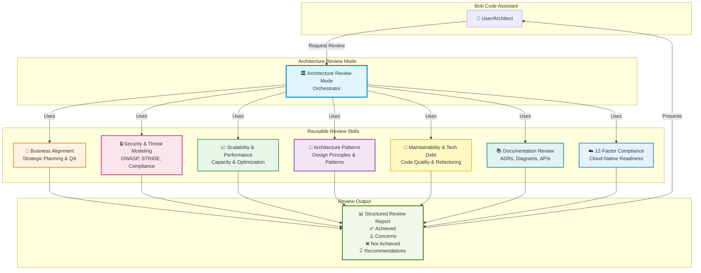
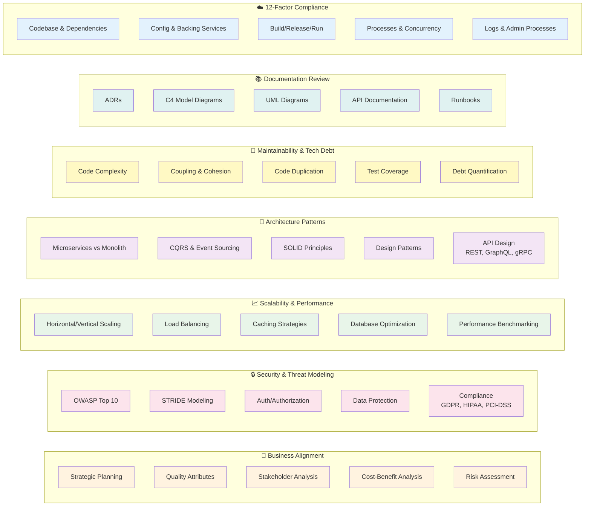
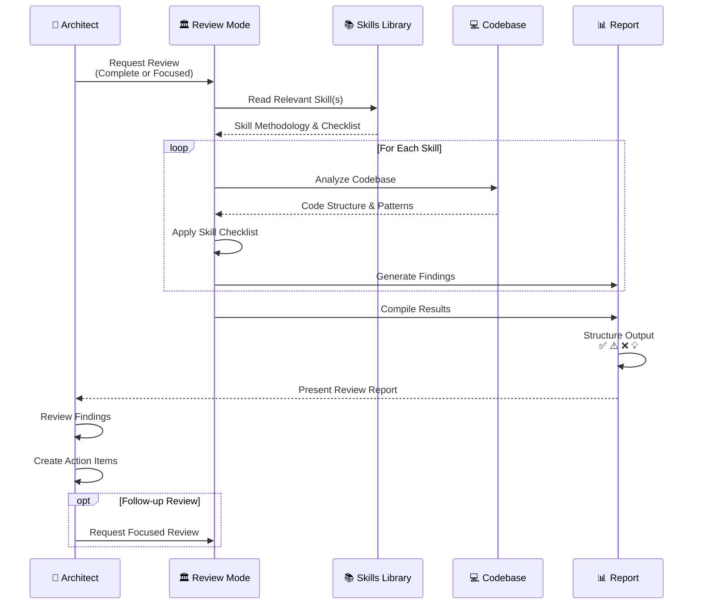
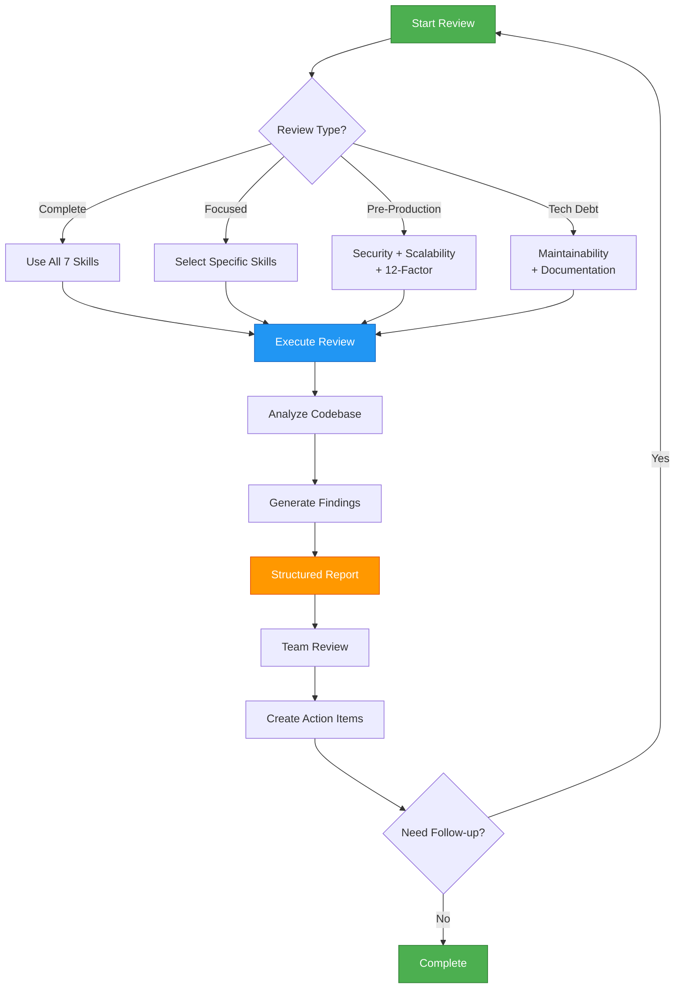
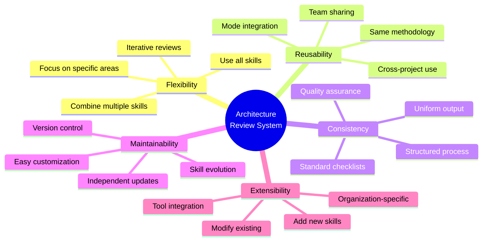
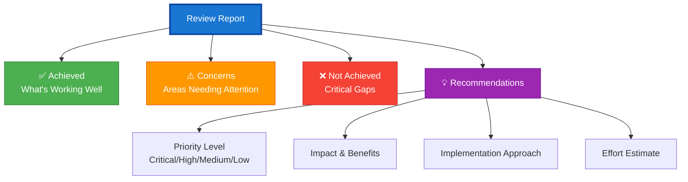

# Architecture Review System - Diagram

## System Overview



## Detailed Skill Breakdown



## Review Workflow



## Usage Patterns



## File Structure

```
📁 Project Root
│
├── 📁 .bob/
│   └── 📄 custom_modes.yaml          # Architecture Review Mode Definition
│
├── 📁 skills/                         # Reusable Review Skills
│   ├── 📄 README.md
│   ├── 🎯 business-alignment-skill.md
│   ├── 🔒 security-threat-modeling-skill.md
│   ├── 📈 scalability-performance-skill.md
│   ├── 🎨 architecture-patterns-skill.md
│   ├── 🔧 maintainability-technical-debt-skill.md
│   ├── 📚 documentation-review-skill.md
│   └── ☁️ twelve-factor-compliance-skill.md
│
└── 📁 documentation/
    ├── 📄 README-ARCHITECTURE-REVIEW.md
    ├── 📄 SDD-README.md
    └── 📁 guides/
        ├── 📄 architecture-review-template.md
        └── 📄 architecture-review-guide.md
```

## Key Benefits



## Review Output Structure



---

**Diagram Version**: 1.0  
**Created**: 2026-04-01  
**Format**: Mermaid (Markdown)  
**Compatible With**: GitHub, GitLab, VS Code, Obsidian, and other Mermaid-supporting platforms