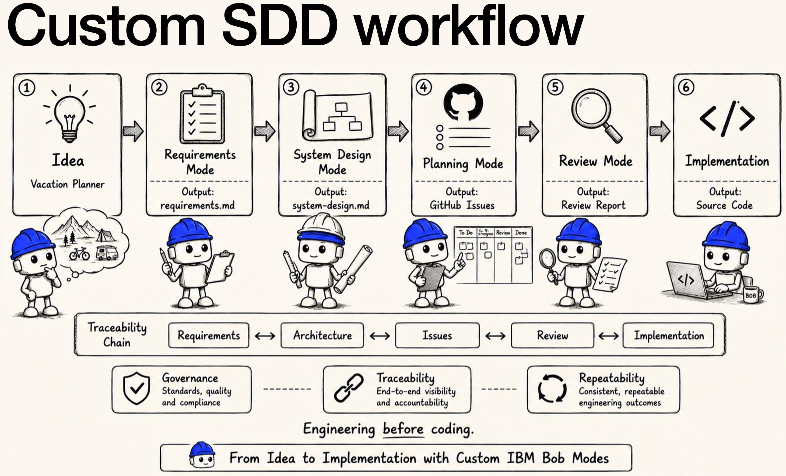
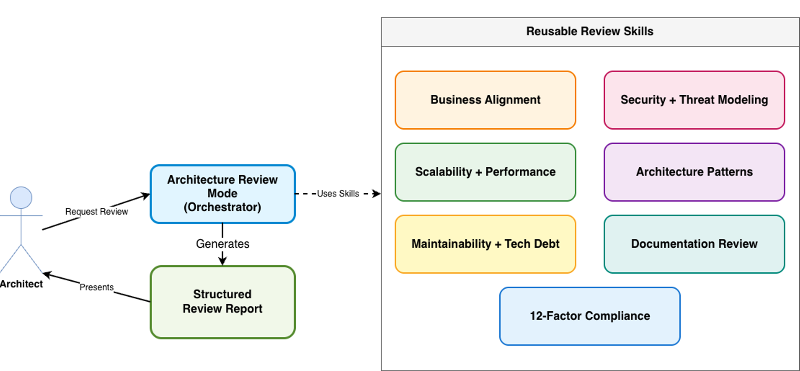
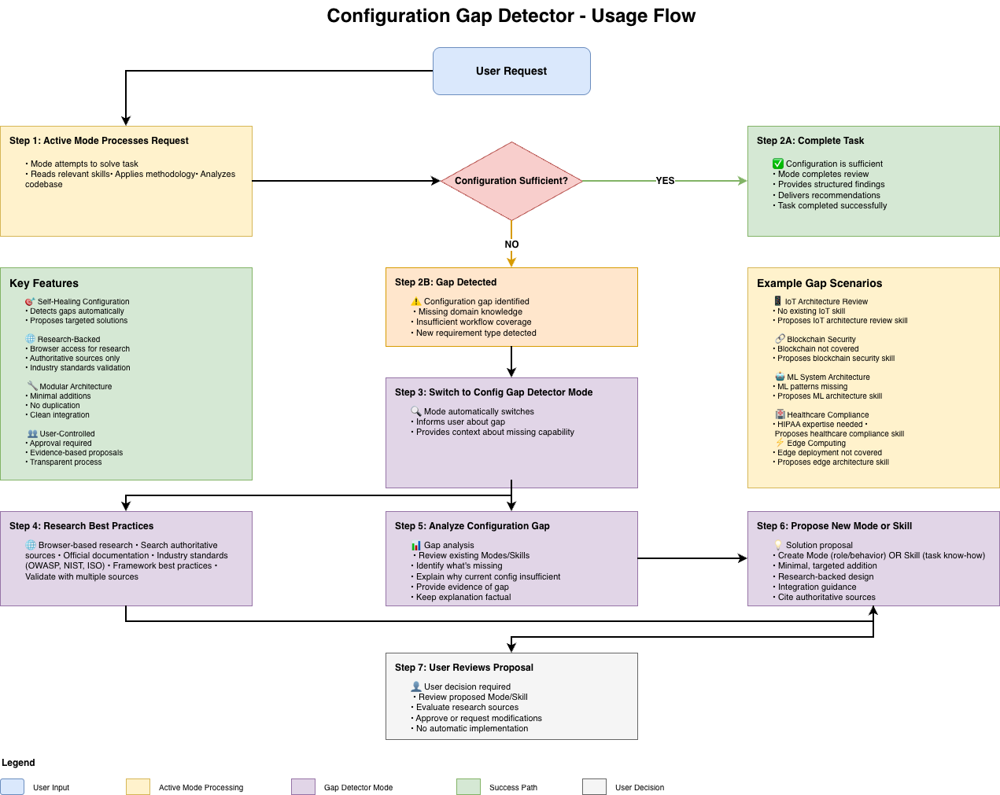
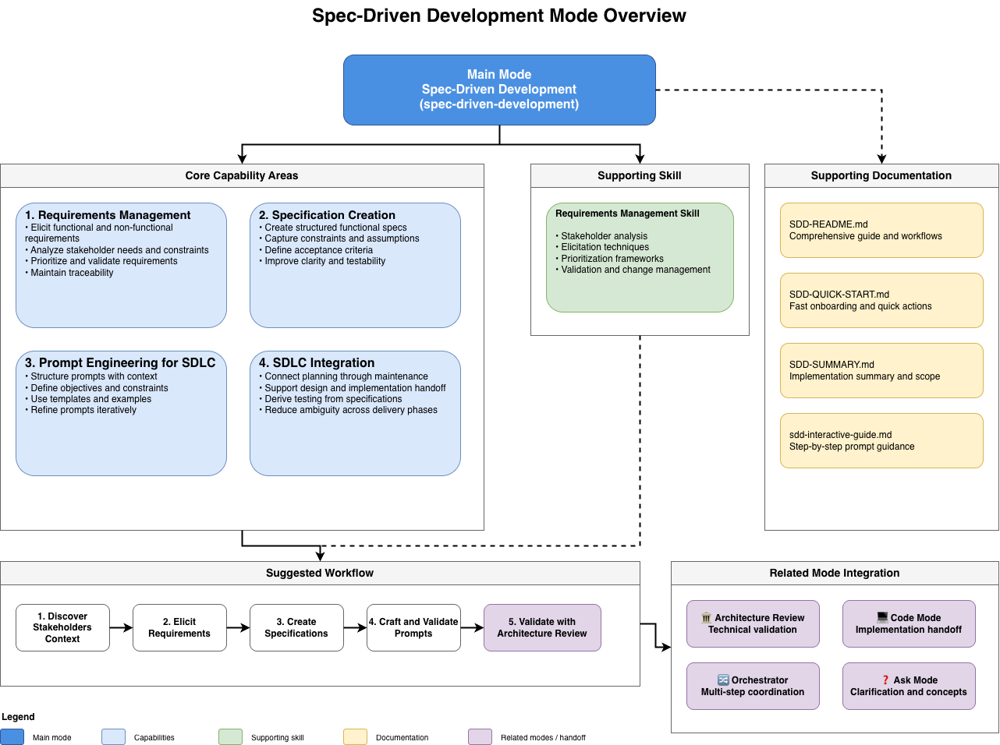

# Review & SDD Expert Bob Configuration

Experimental template / personal reference implementation for IBM Bob SDLC workflow configuration.

## Overview

IBM Bob offers powerful out-of-the-box modes tailored to support the entire software development lifecycle. These modes demonstrate how easily you can specialize and optimize IBM Bob for your specific engineering workflows. In this configuration, the setup is optimized from my perspective for architecture review and spec-driven development (SDD).

The **Review & SDD Expert Bob Configuration** transforms IBM Bob into a specialized assistant for architecture reviews and requirements management. By providing custom-tailored modes and reusable skills, this template enables teams to conduct thorough technical evaluations and implement robust, spec-driven development practices. **The modes included in this repository template** are specifically tuned to bridge the gap between initial system architecture design and precise, specification-compliant code generation.

Additionally, the optional **GitHub issue generator** can convert to-do lists into
GitHub issues when you explicitly request it. The repository includes Python scripts
for batch operations and a legacy GitHub MCP configuration for interactive use.
The legacy MCP package is deprecated and should be replaced before production use.
This repository is intended to be used as a template. Create your own GitHub repository from this template, then clone your repository and open its root folder in IBM Bob. This gives you an independent workspace that you can customize and version-control for your own use.

The custom SDD workflow:



Usage example on YouTube:

[](https://www.youtube.com/watch?v=33zFrqwhKOI)


📚 **[View Full Documentation](./.bob/documentation/README-ARCHITECTURE-REVIEW.md)**

## What It Does

- **11 Custom Modes**: Including orchestrator review mode, 7 focused review modes, spec-driven development mode, configuration gap detector, and GitHub issue generator
- **11 Reusable Skills**: Comprehensive coverage of architecture review domains, SDLC discovery and gap analysis, requirements management, requirements traceability analysis, and GitHub issue traceability
- **Comprehensive Architecture Reviews**: Conduct multi-dimensional reviews using specialized skills covering security, scalability, patterns, maintainability, and more
- **Spec-Driven Development**: Manage requirements, craft prompts, and maintain traceability throughout the development lifecycle
- **Adaptive Configuration**: Use the Grill Me discovery pattern to clarify SDLC intent, detect gaps, and propose new capabilities based on emerging requirements
- **Modular Skills**: Use individual skills independently or combine them for comprehensive reviews

## Traceability Boundary

Traceability matrices in this template are realized only through GitHub issues,
Markdown documents, and code entries such as requirement comments, commit
references, affected files, and tests. External ALM systems, databases,
spreadsheet-only trackers, or proprietary traceability repositories are not
supported sources of truth unless you add a dedicated integration.

## Why Use It?

- ✅ Ensure consistent, repeatable review methodology across projects
- ✅ Reduce time spent on manual architecture reviews and documentation
- ✅ Catch issues early with comprehensive coverage of architecture concerns
- ✅ Customize easily for organization-specific requirements and standards
- ✅ Integrate seamlessly with existing SDLC processes
- ✅ Scale expertise across teams with reusable skills


## Setup & Installation

### Prerequisites

- IBM Bob installed
- Git installed for the recommended GitHub repository workflow
- Node.js and npm installed only when using the optional GitHub MCP integration
- Python 3 and the `requests` package installed only when using the optional
  GitHub issue-management scripts
- A GitHub token configured only when generating GitHub issues

### Recommended: Create Your Own GitHub Repository

1. Select **Use this template** on GitHub and create your own repository.
2. Clone your new repository to your local machine.
3. Open the cloned repository root folder in IBM Bob.
4. The preconfigured modes and skills will appear in IBM Bob's mode selector.

### Alternative: Use a Local Copy

1. Download this repository as a ZIP file.
2. Extract the ZIP file. The extracted folder name depends on the repository
   name and selected branch.
3. Open the extracted repository root folder in IBM Bob.

## Add Repositories for Inspection or Usage

The provided IBM Bob modes are currently configured at project scope. To make
another local repository available to these modes, clone or copy it into the
[`repos/`](./repos/) folder:

```bash
git clone <repository-url> repos/<repository-name>
```

```text
<template-repository-name>/
├── .bob/
├── repos/
│   ├── your-application/
│   └── another-repository/
└── README.md
```

Keep the template repository as the IBM Bob workspace root. Add the
repositories that you want to inspect, review, or use as nested folders under
`repos/`.

## How to Use

### 1. Explore Pre-existing Configuration
Review the available modes and skills to understand capabilities:
- Browse the [11 specialized skills](./.bob/skills/README.md) for different review areas
- Study the [Architecture Review documentation](./.bob/documentation/README-ARCHITECTURE-REVIEW.md)
- Review [Spec-Driven Development guide](./.bob/documentation/SDD-README.md)
- Review the [knowledge source map](./.bob/documentation/KNOWLEDGE_SOURCES.md)
  to understand where mode and skill guidance comes from
- Review the [GitHub issue-management scripts](./.bob/scripts/README.md) when
  generating or synchronizing issues

---

## 🎯 Available Modes

| Mode | Purpose |
| --- | --- |
| 🏛️ Architecture Review | Orchestrates comprehensive and focused reviews |
| 🔒 Security & Threat Modeling | Reviews security architecture and threats |
| 📈 Scalability & Performance | Assesses capacity, bottlenecks, and performance |
| 🎨 Architecture Patterns | Reviews architectural patterns and design choices |
| 🔧 Maintainability & Technical Debt | Identifies maintainability risks and technical debt |
| 📚 Documentation Review | Reviews documentation, license notices, and provenance evidence |
| ☁️ 12-Factor Compliance | Assesses cloud-native readiness |
| 🎯 Business Alignment | Connects architecture decisions to business goals |
| 🧭 Spec-Driven Development | Structures requirements, specifications, and prompts |
| 🔍 Configuration Gap Detector | Proposes missing capabilities when the current setup is insufficient |
| 📋 GitHub Issue Generator | Converts todo lists and findings into GitHub issues |

The configuration also includes **11 reusable skills**: seven architecture
review skills, one SDLC discovery and gap-analysis skill, one
requirements-management skill, one requirements-traceability analysis skill,
and one GitHub issue traceability skill. See the
[skills documentation](./.bob/skills/README.md) for detailed descriptions,
usage guidance, customization options, and examples.

Traceability matrices are intentionally limited to GitHub issues, Markdown
documents, and code entries. See the [SDLC traceability guide](./.bob/documentation/guides/SDLC_TRACEABILITY_GUIDE.md)
for the supported traceability carriers and matrix format.

## Configuration Visuals








---

## Demo Workflow

1. Clone this template.
2. Add a sample repo under /repos.
3. Start IBM Bob.
4. Select Architecture Review mode.
5. Run this prompt:
   "Review security, maintainability, and 12-factor compliance for repos/example-app."
6. Expected output:
   - achieved / concerns / not achieved
   - prioritized findings
   - GitHub issue candidates

---

## 💡 Usage Examples

Add code or a repository to your IBM Bob IDE, then follow the examples.

For this template, add the repository that you want to inspect or use under
[`repos/`](./repos/). The nested repository layout is required because the
provided modes are currently configured at IBM Bob project scope.

### Example 1: Pre-Production Review

```
User: "Review security, scalability, and 12-factor compliance before production"

Bob will:
1. Read 3 relevant skill files
2. Apply each skill's methodology
3. Analyze codebase against checklists
4. Provide prioritized findings
5. Recommend critical fixes

Output:
✅ Achieved: OAuth2 implemented, auto-scaling configured
⚠️ Concerns: No rate limiting, logs not centralized
❌ Not Achieved: Missing circuit breakers
💡 Recommendations: [Prioritized action items]
```

### Example 2: Technical Debt Assessment

```
User: "Analyze technical debt and maintainability"

Bob will:
1. Read maintainability-technical-debt-skill.md
2. Analyze code complexity and coupling
3. Detect code duplication
4. Assess test coverage
5. Quantify technical debt
6. Provide refactoring roadmap

Output: Prioritized technical debt backlog with effort estimates
```

### Example 3: Security Audit

```
User: "Perform STRIDE threat modeling and check OWASP Top 10"

Bob will:
1. Read security-threat-modeling-skill.md
2. Identify security gaps and attack vectors
3. Check for OWASP Top 10 vulnerabilities
4. Assess authentication/authorization
5. Provide risk ratings and remediation steps

Output: Security assessment report with prioritized fixes
```

### Example 4: Convert Todo List to GitHub Issues

```
User: "Convert my current todo list into GitHub issues"

Bob will:
1. Read the active todo list from current task
2. Analyze each task for context and requirements
3. Check for existing similar issues in GitHub
4. Create well-structured GitHub issues with:
   - Clear, action-oriented titles
   - Detailed descriptions with context
   - Acceptance criteria
   - Appropriate labels (type, priority, area)
5. Establish issue relationships and dependencies
6. Provide summary with issue links

Output: List of created GitHub issues with numbers and links
```

---

## 🎓 Best Practices

### Mode Selection Strategy

1. **Start with Plan mode** for new projects
   - Create detailed implementation plan
   - Break down into clear steps
   - Get user approval

2. **Switch to Code/Advanced mode** for implementation
   - Execute approved plan
   - Make code changes
   - Run tests

3. **Use Architecture Review mode** for validation
   - Review completed work
   - Identify issues early
   - Ensure quality standards

4. **Use Ask mode** for explanations
   - Understand concepts
   - Get recommendations
   - Learn technologies

### Effective Review Requests

#### ✅ Good Examples

**Specific and focused**:
```
"Review security for a healthcare application that needs HIPAA compliance"
```

**With context**:
```
"Analyze scalability for an e-commerce platform expecting 10x growth"
```

**Prioritized**:
```
"Focus on security and 12-factor compliance first, then performance"
```

#### ❌ Avoid These

- "Review the system" (too vague)
- "Check everything" (no context)
- "Do all reviews at once and fix all issues" (unrealistic scope)

---

## 🔧 Customization

### Adding Organization-Specific Requirements

1. **Modify existing skills**

   Edit skill files in `.bob/skills/` to add:
   - Internal compliance requirements
   - Company-specific patterns
   - Custom quality attributes
   - Organization standards
   - License notice and content-provenance requirements

2. **Create new skills**

   ```bash
   # Copy an existing skill as template
   cp .bob/skills/security-threat-modeling-skill.md \
      .bob/skills/custom-compliance-skill.md
   ```

   Then customize:
   - Purpose and expertise areas
   - Review process and checklists
   - Output format
   - Key questions and best practices

3. **Update mode configuration**

   Update `.bob/custom_modes.yaml` so that the relevant mode explicitly
   references the new skill when it should be part of a standard workflow.
   For license notice or provenance checks, prefer extending the existing
   Documentation Review skill unless a dedicated legal/compliance workflow is
   required.

### Skill Structure Template

```markdown
# [Skill Name]

## Purpose
[What this skill evaluates]

## Expertise Areas
- [Area 1]
- [Area 2]

## Review Process
### 1. [Step Name]
- [Checklist item]
- [Question to ask]

## Output Format
### ✅ Achieved
[What's working well]

### ⚠️ Concerns
[Areas needing attention]

### ❌ Not Achieved
[Critical gaps]

### 💡 Recommendations
[Actionable improvements]
```

---

## 📖 Documentation

### Quick References

| Document | Purpose |
|----------|---------|
| **README.md** | Main documentation (this file) |
| **[agents.md](./agents.md)** | Agent routing rules and hard constraints for IBM Bob |
| **[.bob/skills/README.md](./.bob/skills/README.md)** | Skills documentation |
| **[.bob/documentation/README-ARCHITECTURE-REVIEW.md](./.bob/documentation/README-ARCHITECTURE-REVIEW.md)** | Architecture review details |
| **[.bob/documentation/KNOWLEDGE_SOURCES.md](./.bob/documentation/KNOWLEDGE_SOURCES.md)** | Mode and skill knowledge-source map |
| **[.bob/documentation/RESOURCE_LICENSES.md](./.bob/documentation/RESOURCE_LICENSES.md)** | License and terms map for external mode resources |
| **[.bob/documentation/guides/QUICK-START.md](./.bob/documentation/guides/QUICK-START.md)** | Quick start guide |
| **[.bob/documentation/guides/CREATING-AGENTS-MD.md](./.bob/documentation/guides/CREATING-AGENTS-MD.md)** | Guide for creating agents.md files |
| **[.bob/documentation/SDD-README.md](./.bob/documentation/SDD-README.md)** | Spec-driven development |
| **[.bob/documentation/GITHUB-ISSUE-GENERATOR-MODE.md](./.bob/documentation/GITHUB-ISSUE-GENERATOR-MODE.md)** | GitHub issue generator mode |
| **[.bob/scripts/README.md](./.bob/scripts/README.md)** | GitHub issue-management scripts |
| **[GITHUB_MCP_SETUP.md](./.bob/documentation/GITHUB_MCP_SETUP.md)** | GitHub MCP server setup |

## agents.md

The [`agents.md`](./agents.md) file is read by IBM Bob at task start. It contains only the
information the agent cannot infer from mode definitions or skill files:

- **Workspace constraint** — repositories to review must be placed under `repos/`
- **Mode routing table** — maps a user's intent to the correct mode slug
- **Hard rules** — three cross-cutting constraints that apply in every mode:
  1. Always read the skill file before producing findings
  2. Traceability runs through GitHub issues, Markdown, and code only
  3. Unknown domain → escalate to `config-gap-detector` before proceeding

Keep `agents.md` short. Mode-specific behaviour belongs in `.bob/custom_modes.yaml`;
skill-specific methodology belongs in `.bob/skills/`. Do not duplicate that content here.

## Documentation Validation

After changing Markdown documentation, validate local links and heading anchors:

```bash
python3 .bob/scripts/check_markdown_links.py
```

## Limitations

This template does not replace architecture review boards, security review, legal review, or formal ALM tooling. It provides a Git-native, Markdown-based structure for improving consistency, traceability, and review preparation when working with IBM Bob.

## License and Third-Party Notices

This repository is distributed under the Apache License, Version 2.0. See
[LICENSE](./LICENSE) for the full license text.

- [License documentation](./LICENSE_DOCUMENTATION.md)
- [Third-party dependency notices](./THIRD_PARTY_NOTICES.md)
- [Content provenance register](./CONTENT_PROVENANCE.md)
- [Mode resource license map](./.bob/documentation/RESOURCE_LICENSES.md)
